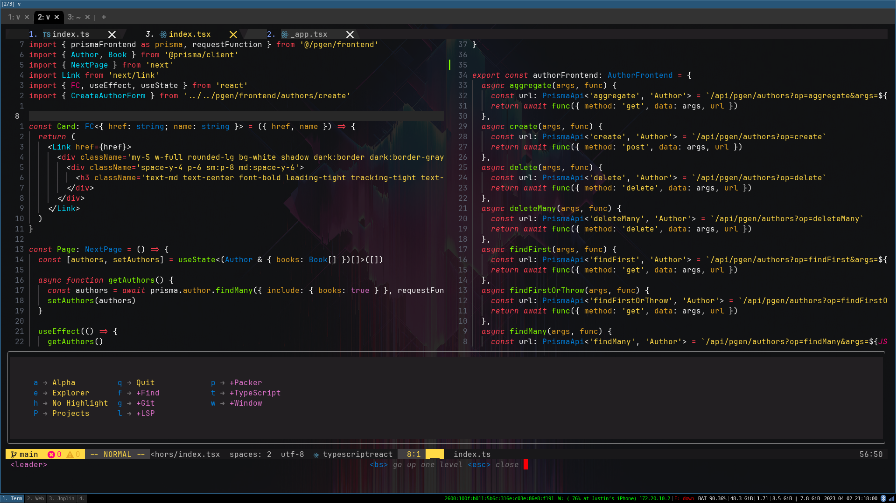

<div align="center">
    <div class="b-header">
        <a class="active" href="https://github.com/justinsgithub/oh-my-monokai.nvim">
            
            <h1>Oh My Monokai</h1>
            <h2>Edit your code obnoxiously</h2>
        </a>
    </div>
</div>


### Create your own palette


### 🔌 Plugin support

- [alpha-nvim](https://github.com/goolord/alpha-nvim)
- [bufferLine.nvim](https://github.com/akinsho/bufferline.nvim)
- [Cmp](https://github.com/hrsh7th/nvim-cmp)
- [vim-illuminate](https://github.com/RRethy/vim-illuminate)
- [indent-blankline](https://github.com/lukas-reineke/indent-blankline.nvim)
- [neo-tree.nvim](https://github.com/nvim-neo-tree/neo-tree.nvim)
- [nvim-notify](https://github.com/rcarriga/nvim-notify)
- [renamer.nvim](https://github.com/filipdutescu/renamer.nvim)
- [lualine.nvim](https://github.com/nvim-lualine/lualine.nvim)
- [telescope.nvim](https://github.com/nvim-telescope/telescope.nvim)
- [toggleterm.nvim](https://github.com/akinsho/toggleterm.nvim)
- [nvim-treesitter](https://github.com/nvim-treesitter/nvim-treesitter)
- [which-key.nvim](https://github.com/folke/which-key.nvim)
- [breadcrumb.nvim](https://github.com/loctvl842/breadcrumb.nvim)
- [nvim-navic](https://github.com/SmiteshP/nvim-navic)
- [wilder.nvim](https://github.com/gelguy/wilder.nvim)
- [Lightline](https://github.com/itchyny/lightline.vim)
- [barbecue.nvim](https://github.com/utilyre/barbecue.nvim)
- [dashboard-nvim](https://github.com/glepnir/dashboard-nvim)
- [mason.nvim](https://github.com/williamboman/mason.nvim)

## 📦 Installation

[vim-plug](https://github.com/junegunn/vim-plug)

```vim
Plug 'justinsgithub/oh-my-monokai.nvim'
```

[packer](https://github.com/wbthomason/packer.nvim)

```lua
use {
  "justinsgithub/oh-my-monokai.nvim",
  config = function()
    require("oh-my-monokai").setup()
  end
}
```

## 🔨 Configuration

There are two palettes included in this plugin currently, the default and my own custom (justinsgithub).

You can easily create create your own, just fork this repository and add a file called `./lua/oh-my-monokai/colorscheme/palette/{your_github_user_name}.lua`

Copy the default palette to your personal file and customize as needed

Then make a pull request and you'll have your own custom theme


Example configuration:

```lua
require("oh-my-monokai").setup({
  transparent_background = false,
  terminal_colors = true,
  devicons = true, -- highlight the icons of `nvim-web-devicons`
  palette = "default", -- or create your own ^^ e.g. justinsgithub
  inc_search = "background", -- underline | background
  background_clear = {
    -- "float_win",
    "toggleterm",
    "telescope",
    "which-key",
    "renamer"
  },-- "float_win", "toggleterm", "telescope", "which-key", "renamer", "neo-tree"
  plugins = {
    bufferline = {
      underline_selected = false,
      underline_visible = false,
    },
    indent_blankline = {
      context_highlight = "default",
      context_start_underline = false,
    },
  },
  ---@param c Colorscheme
  override = function(c) end,
})

## 📚 Usage

- Enable this colorscheme by using the following command after `setup`:

```vim
" Vim Script
colorscheme oh-my-monokai
```

```lua
require("oh-my-monokai").setup({
  -- ... your config
})
-- lua
vim.cmd([[colorscheme oh-my-monokai]])
```

- To enable `oh-my-monokai` for `Lualine`:

```lua
require('lualine').setup {
  options = {
    -- ...
    theme = 'oh-my-monokai'
    -- ...
  }
}
```

- To enable `oh-my-monokai` for `barbecue`:

```lua
require('barbecue').setup {
  -- ...
  theme = 'oh-my-monokai'
  -- ...
}

```

- To enable `oh-my-monokai` for `lightline`:

```vim
" Vim Script
let g:lightline = {'colorscheme': 'omm'}
```

- Override function:

```lua
require("oh-my-monokai").setup({
    -- ...
    override = function
      return {
          Normal = { bg = "#000000" }
        }
    end
    -- ...
  })
```

## 🔧 Command

- run command `OMMPalette` to launch a menu and choose theme palette, you must have [nui.nvim](https://github.com/MunifTanjim/nui.nvim) installed
- or run command `OMM` with parameter to change theme palette: For example:
  > `OMM justinsgithub`
